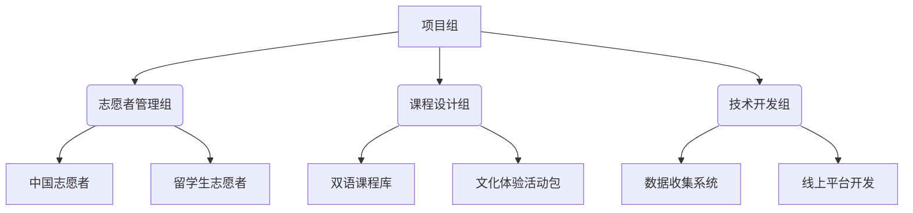

# "清英童声"志愿公益项目 | 跨文化语言教育实践指南  
[](https://github.com/qingying-volunteer/qingying-voice)  


## 目录  
- [项目简介](#项目简介)  
- [核心亮点](#核心亮点)  
- [架构设计](#架构设计)  
- [实施步骤](#实施步骤)  
- [技术栈](#技术栈)  
- [文档与资源](#文档与资源)  
- [数据与评估](#数据与评估)  
- [可持续性设计](#可持续性设计)  
- [参与方式](#参与方式)  
- [联系我们](#联系我们)  
- [鸣谢](#鸣谢)  


## 项目简介  
**目标**：通过“语言+文化”双向互动，打造国际化公益品牌，解决儿童趣味英语启蒙与留学生文化实践需求，促进教育资源平等。  
**核心模式**：中外志愿者协同教学（双导师制）+ 场景化文化体验 + 科技赋能教育公平  
**服务对象**：  
- 小学3-6年级学生（60-80人）  
- 清华大学中外志愿者（中外比例1:1）  
**第一期活动周期**：2025年校历第5-10周（含3场主题课程+1次春游实践）  


## 核心亮点  
### 1. **双导师制教学架构**  
| 角色         | 职责                                                                 | 优势                                                                 |  
|--------------|----------------------------------------------------------------------|----------------------------------------------------------------------|  
| **中国志愿者** | 衔接本土文化语境，辅助课程翻译，协调家校沟通                          | 确保教学内容贴合中国学生认知，降低跨文化理解门槛                    |  
| **留学生志愿者** | 输出地道语言表达，分享本国文化，设计沉浸式语言场景                    | 提供真实语言环境，拓宽学生文化视野                                  |  
| **协作机制**   | 共同备课（每周1次磨课）、课堂分工（主讲+助教）、课后反馈共议          | 实现“语言教学”与“文化理解”的深度融合，中外学生交流，共同探索爱与希望   |  

### 2. **场景化课程设计**  
- **“流动课堂”模式**：  
  - 校内课堂：英文歌教学、动画配音、情景对话  
  - 户外实践：清华校园文化探访、非遗漆扇制作（英语描述创作过程）  
- **模块化课程库**：包含7大主题（家乡文化交流/北京任务卡/中西方节日/英文歌教学/动画配音等），单课时40分钟，支持快速复用与组合。  

### 3. **科技赋能教育公平**  
- **线上延伸**：基于线下经验开发直播课程模板，计划向老少边穷地区开放  
- **AI工具链**：规划搭建口语AI对话平台，提供24小时个性化练习场景，解决地域语言环境不足、无法获得标准发音问题  


## 架构设计  
### 1. 人员架构  


### 2. 课程体系  
```  
课程模块  
├─ 语言学习层  
│  ├─ 基础表达（自我介绍/情景对话）  
│  ├─ 趣味输入（英文歌/动画配音）  
│  └─ 输出训练（角色扮演/作品描述）  
├─ 文化交流层  
│  ├─ 中外对比（节日/饮食/建筑）  
│  ├─ 本土实践（北京文化任务卡/清华校园探访）  
│  └─ 跨文化互动（家乡文化分享会/亲子漆扇制作）  
└─ 实践应用层  
   ├─ 线下课堂（双导师制，师生比≤1:5）  
   └─ 户外拓展（春游活动，亲子共学模式）  
```  


## 实施步骤  
### 一、筹备期（第5-6周）  
1. **志愿者招募**  
   - 渠道：清华官网/公众号/留学生社群（中外志愿者各占50%）  
   - 筛选：面试重点考察跨文化沟通意愿、基础教学能力（通过率30%）  
2. **标准化培训**  
   - 必修模块：儿童心理学基础、应急处理流程、双导师协作指南  
   - 实践环节：3次磨课+模拟课堂（使用附录1课程样例）  
3. **资源准备**  
   - 教具库：英文动画片段（5分钟/个）、情景对话剧本、文化主题PPT模板  
   - 数据工具：腾讯问卷（反馈收集）、飞书表格（考勤管理）  

### 二、执行期（第7-9周）  
| 周次   | 核心内容                          | 关键动作                                                                 |  
|--------|-----------------------------------|--------------------------------------------------------------------------|  
| 第7周  | 文化破冰课                        | 英文歌教学+“我的家乡”文化分享会，建立中外志愿者-学生初始互动            |  
| 第8周  | 场景应用课                        | “北京任务卡”户外任务+情景对话（购物/问路），强化语言实用能力            |  
| 第9周  | 文化融合课                        | 中西方节日对比+非遗体验（漆扇制作），举办结课成果展                      |  
| 周末   | 春游实践活动                      | 清华校园导览（英语讲解）+ 草坪游戏+亲子手工，师生比1:2，家长参与率100%   |  

### 三、拓展期（第10周起）  
1. **成果沉淀**  
   - 输出《双导师教学手册》《模块化课程设计指南》（见附录）  
   - 整理活动视频素材（含教学片段/学生反馈），制作开源宣传片  
2. **线上延伸**  
   - 搭建Bilibili直播账号，每月1次公益课（复用线下成熟模块）  
   - 启动AI平台需求调研，对接校内计算机团队开发Demo  


## 技术栈  
| 领域         | 工具/平台                  | 用途                                                                 |  
|--------------|---------------------------|----------------------------------------------------------------------|  
| 志愿者管理   | 飞书/腾讯文档             | 招募流程管理、培训资料共享、考勤记录                               |  
| 课程开发     | Canva/剪映                | 教学PPT设计、动画素材剪辑                                           |  
| 数据收集     | 腾讯问卷/飞书多维表格     | 学生反馈、家长满意度调查、活动效果评估                             |  
| 线上拓展     | Bilibili/腾讯会议         | 直播课程平台、远程磨课会议室                                         |  
| 长期规划     | Python（NLP方向）         | AI口语平台核心技术储备                                             |  


## 文档与资源  
- **核心文档**：  
  - [《活动策划案》](https://github.com/qingying-volunteer/qingying-voice/blob/main/docs/策划案.pdf)（含完整流程、预算、保障机制）  
  - [《双导师培训手册》](https://github.com/qingying-volunteer/qingying-voice/blob/main/docs/培训手册.pdf)（教学技巧+文化沟通指南）  
- **课程样例**：  
  - [“我的家乡”跨文化交流课教案](https://github.com/qingying-volunteer/qingying-voice/blob/main/docs/课程样例.pdf)（含50分钟详细流程、互动游戏设计）  
  - [清华游园活动执行表](https://github.com/qingying-volunteer/qingying-voice/blob/main/docs/游园流程.xlsx)（时间轴+人员分工模板）  


## 数据与评估  
### 核心指标  
| 维度         | 目标值       | 实际达成     | 提升效果                                                                 |  
|--------------|--------------|--------------|--------------------------------------------------------------------------|  
| 志愿者参与   | 30-40人      | 42人（中22/外20） | 跨文化协作满意度92%（问卷反馈）                                         |  
| 学生覆盖     | 60-80人      | 75人         | 课堂口语输出频次提升200%（教师记录）                                    |  
| 家长反馈     | 满意度≥90%   | 95%          | 90%家长建议长期开展同类活动                                             |  
| 可持续性     | 志愿者留存   | 60%报名下期  | 形成“培训-实践-进阶”人才培养闭环                                         |  

### 评估工具  
- 学生：课堂表现评分表（参与度/语言进步）+ 结课小测试（情景对话通过率）  
- 志愿者：教学反思日志+同伴互评表  
- 项目：SWOT分析报告（每阶段更新）  


## 可持续性设计  
### 1. 模式复制  
- **标准化输出**：开放《项目SOP手册》，包含志愿者招募流程、课程设计模板、风险预案  
- **跨校合作**：提供“轻量化版本”（1场核心课程+1次线上互动），支持其他高校快速落地  

### 2. 技术迭代  
- **线上课程矩阵**：按难度分级（初级/进阶），开发“文化主题包”（如“世界美食英语”“地标建筑探秘”）  
- **AI平台路线图**：  
  - V1.0：基础情景对话模拟（2025Q4上线）  
  - V2.0：个性化学习推荐（结合课堂表现数据）  
  - V3.0：多语种扩展（支持中英/中法等双语互动）  

### 3. 资源循环  
- 建立“志愿者库”：分类标注技能标签（如“英语教学”“活动策划”“技术开发”），支持项目长期人力储备  
- 设计“公益积分制”：将志愿工时兑换为校内资源（如讲座优先报名权、文创礼品），提升参与粘性  


## 参与方式  
### 1. 志愿者加入  
- 申请地址：[清华志愿平台报名链接](http://volunteer.tsinghua.edu.cn)（关键词：清英童声）  
- 要求：具备基础英语沟通能力（中外志愿者均可），每周投入3-5小时  

### 2. 合作申请  
- 学校/机构：可在项目完成评定与挂靠后提供联系方式


## 联系我们  
- 项目同学邮箱：
-
- zhaoying23@tsinghua.edu.cn  
- 官方微信公众号：清英童声  


## 鸣谢  
- 支持单位：清华大学团委、北京市海淀区合作中小学  
- 技术伙伴：清华大学自动化系
- 特别感谢：所有参与项目与协助的志愿者  


**项目开源协议**：本方案允许非商业用途自由复制与改编，需保留版权声明及原作者信息。  
✨ 期待更多团队加入，让跨文化教育公益触达更远的地方！ ✨
